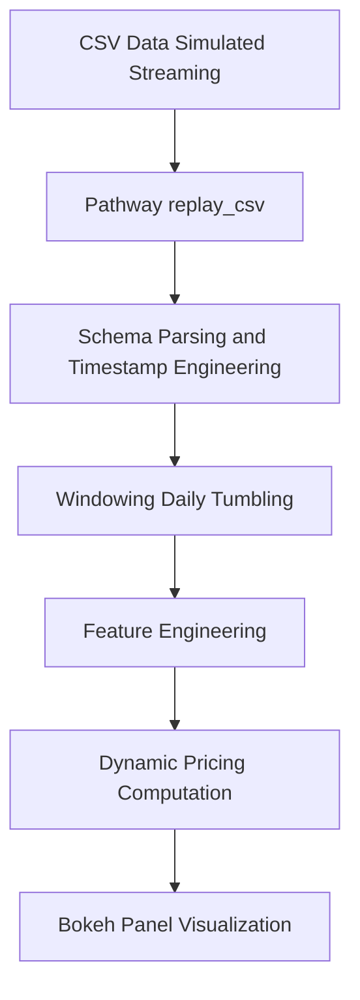

# IITG-Summer-Analytics-2025

## Organized by Consulting & Analytics Club, IIT Guwahati

---

## 🚀 Project: Real-Time Dynamic Parking Pricing using Pathway

This capstone implements a **real-time data streaming pipeline** to dynamically compute parking prices based on live occupancy data, leveraging **Pathway** for stream processing and **Bokeh** for visualization.

It demonstrates:
- **Live data ingestion and streaming using Pathway**
- **Feature engineering** on streaming data for advanced pricing
- **Dynamic pricing based on utilization, demand fluctuation, peak hours, and surge pricing**
- **Live visualization** of pricing signals using interactive dashboards

---

## 🛠️ Tech Stack

- **Python 3.11+**
- **Pathway** (real-time data streaming and windowing)
- **Pandas** (initial preprocessing)
- **Bokeh** + **Panel** (interactive visualization)
- **Jupyter Notebook** (development and demonstration)
- **Git + GitHub** (version control and submission)

---

## 🗂️ Repository Structure

```
📁 IITG-Summer-Analytics-2025/FINAL
│
├── Notebook_FINAL.ipynb      # Clean, working notebook with explanations
├── Notebook_FINAL.ipynb - Colab.pdf                  # This documentation
├── bokeh_plot.png      # plot
├── dataset.csv        # dataset
├── parking_stream.csv  # parking_stream data
└── problem statement.pdf #problem statement
```

---

## 🖼️ Architecture Diagram



---

## 🛠️ Project Architecture and Workflow

**1️⃣ Data Ingestion:**
- CSV file simulating parking spot occupancy over time
- Loaded using `pd.read_csv` and streamed using `pw.demo.replay_csv`

**2️⃣ Preprocessing:**
- Combine `Date` and `Time` into `Timestamp`
- Sort chronologically

**3️⃣ Pathway Streaming Pipeline:**
- Define `ParkingSchema`
- Stream the data using `replay_csv`
- Parse timestamps and extract day and hour features
- Apply **daily tumbling windows** for aggregation
- Compute `occ_max`, `occ_min`, and `capacity` per day

**4️⃣ Advanced Pricing Model:**
- Base price of 5
- Add demand fluctuation scaled by 10
- +2 during peak hours (8 AM - 6 PM)
- Apply a surge multiplier of 1.5 if utilization > 80%
- Compute and round final price dynamically in the stream

**5️⃣ Visualization:**
- Use Bokeh to generate an interactive plot
- View real-time streaming price signals

**6️⃣ Execution:**
- Run `pw.run()` to execute the real-time pipeline in the background
- Observe latency and progress in Pathway's dashboard
- Interact with the live Bokeh plot served using Panel

---


## 📊 Results

- Successfully implemented a **dynamic pricing pipeline**
- Real-time visualization shows price fluctuations aligned with occupancy patterns
- Demonstrates practical use of **Pathway streaming for analytics workflows**

---

## ✍️ Credits

- **Developed for:** IITG Summer Analytics 2025 Capstone
- **Organized by:** Consulting & Analytics Club, IIT Guwahati
- **Made by:** Shubhayu Kundu

---

## 📄 License

This project is submitted solely for academic evaluation for **IITG Summer Analytics 2025**.

---

**Feel free to extend this pipeline to:**
- Multi-spot data ingestion
- Predictive ML models for pricing
- Integration with weather/event data for further enhancements
